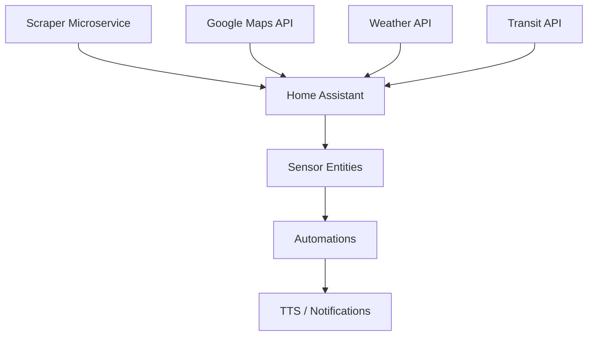

<div align="center">

# 🚗 HA Commute Helper

> **Home Assistant integration for real-time commute briefings with traffic, weather, and transport updates**


[Features](#-features) • [Installation](#-installation) • [Configuration](#️-configuration) • [Contributing](#-contributing)

</div>

---

## 📑 Table of Contents

- [✨ Features](#-features)
- [📋 Prerequisites](#-prerequisites)
- [🚀 Installation](#-installation)
- [⚙️ Configuration](#️-configuration)
- [📖 Usage](#-usage)
- [🔧 Architecture](#-architecture)
- [🎙️ Voice Briefings](#️-voice-briefings)
- [🐛 Troubleshooting](#-troubleshooting)
- [🤝 Contributing](#-contributing)
- [📄 License](#-license)
- [👤 Author](#-author)

---

## ✨ Features

| Feature | Description |
|---------|-------------|
| 🚦 **Real-time Traffic** | Live traffic conditions on your commute route |
| 🌤️ **Weather Briefing** | Current conditions and forecast for departure |
| 🚇 **Transit Updates** | Public transport delays and disruptions |
| 🎙️ **Voice Announcements** | TTS briefings via smart speakers |
| ⏰ **Smart Scheduling** | Briefings based on your work schedule |
| 📊 **Commute Stats** | Track and analyze commute times |
| 🔄 **Scraper Microservice** | Real-time data collection |
| 🏠 **HACS Compatible** | Easy installation via HACS |

---

## 📋 Prerequisites

| Requirement | Version |
|-------------|---------|
| Home Assistant | 2023.1+ |
| HACS | Latest |
| Python | 3.11+ (for scraper) |

### Required Integrations

- Google Maps API (or alternative)
- Weather integration (e.g., Met Office, OpenWeatherMap)
- TTS service (optional, for voice briefings)

---

## 🚀 Installation

### Option 1: HACS (Recommended)

1. Open HACS in Home Assistant
2. Click **Integrations** → **+ Explore & Download Repositories**
3. Search for "HA Commute Helper"
4. Click **Download**
5. Restart Home Assistant

### Option 2: Manual Installation

```bash
# Clone the repository
cd /config
git clone https://github.com/CaputoDavide93/HA_Commute_Helper.git

# Copy custom component
cp -r HA_Commute_Helper/custom_components/commute_helper custom_components/

# Copy packages
cp -r HA_Commute_Helper/packages/* packages/

# Restart Home Assistant
```

### Option 3: With Scraper Microservice

```bash
# Deploy scraper
cd scraper-microservice
docker-compose up -d
```

---

## ⚙️ Configuration

### 1. Configure Secrets

Copy and edit the secrets template:

```bash
cp secrets_template.yaml secrets.yaml
```

```yaml
# secrets.yaml
commute_origin: "Your Home Address"
commute_destination: "Your Work Address"
google_maps_api_key: "your-api-key"
weather_api_key: "your-weather-key"
```

### 2. Add to configuration.yaml

```yaml
# configuration.yaml
homeassistant:
  packages: !include_dir_named packages/

commute_helper:
  origin: !secret commute_origin
  destination: !secret commute_destination
  arrival_time: "09:00"
  departure_sensor: sensor.commute_departure_time
```

### 3. Configure Automations

```yaml
automation:
  - alias: "Morning Commute Briefing"
    trigger:
      - platform: time
        at: "07:00"
    condition:
      - condition: state
        entity_id: binary_sensor.workday_sensor
        state: "on"
    action:
      - service: tts.speak
        entity_id: media_player.kitchen_speaker
        data:
          message: "{{ state_attr('sensor.commute_briefing', 'full_text') }}"
```

---

## 📖 Usage

### Available Entities

| Entity | Description |
|--------|-------------|
| `sensor.commute_time` | Current estimated commute (minutes) |
| `sensor.commute_departure_time` | Recommended departure time |
| `sensor.commute_briefing` | Full text briefing |
| `binary_sensor.commute_delayed` | True if delays detected |
| `sensor.commute_traffic_level` | Traffic severity (low/medium/high) |

### Lovelace Card Example

```yaml
type: entities
title: Morning Commute
entities:
  - entity: sensor.commute_time
    name: Travel Time
  - entity: sensor.commute_departure_time
    name: Leave By
  - entity: sensor.commute_traffic_level
    name: Traffic
  - entity: sensor.weather_temperature
    name: Temperature
```

---

## 🔧 Architecture



### Project Structure

```
HA_Commute_Helper/
├── custom_components/
│   └── commute_helper/
│       ├── __init__.py
│       ├── manifest.json
│       └── sensor.py
├── packages/
│   └── commute_helper.yaml
├── scraper-microservice/
│   ├── Dockerfile
│   ├── docker-compose.yml
│   └── main.py
├── hacs.json
└── secrets_template.yaml
```

---

## 🎙️ Voice Briefings

### Example Briefing Output

> "Good morning! Your commute to work is currently 35 minutes due to moderate traffic on the M25. The weather is partly cloudy at 12 degrees. Leave by 8:25 to arrive on time. Have a great day!"

### Customizing Briefings

```yaml
# In packages/commute_helper.yaml
template:
  - sensor:
      - name: "Commute Briefing"
        state: "{{ states('sensor.commute_time') }} min"
        attributes:
          full_text: >
            Good morning! Your commute is {{ states('sensor.commute_time') }} minutes.
            
            There is {{ states('sensor.commute_traffic_level') }} traffic.
            
            Temperature is {{ states('sensor.weather_temperature') }}°.
```

---

## 🐛 Troubleshooting

### Common Issues

<details>
<summary>❌ Entity Not Found</summary>

```bash
# Check if component loaded
ha core info

# Verify configuration
ha core check
```
</details>

<details>
<summary>❌ API Rate Limit</summary>

Reduce polling frequency in configuration:
```yaml
commute_helper:
  scan_interval: 600  # 10 minutes
```
</details>

<details>
<summary>❌ Scraper Not Connecting</summary>

```bash
# Check scraper logs
docker-compose logs -f scraper

# Verify network connectivity
curl http://localhost:8080/health
```
</details>

---

## 🤝 Contributing

Contributions are welcome! Please see [CONTRIBUTING.md](CONTRIBUTING.md) for guidelines.

1. Fork the repository
2. Create a feature branch (`git checkout -b feature/amazing-feature`)
3. Commit changes (`git commit -m 'Add amazing feature'`)
4. Push to branch (`git push origin feature/amazing-feature`)
5. Open a Pull Request

---

## 📄 License

This project is licensed under the MIT License - see the [LICENSE](LICENSE) file for details.

---

<div align="center">

## 👤 Author

**Davide Caputo**

[](https://github.com/CaputoDavide93)
[](mailto:CaputoDav@gmail.com)

---

⭐ **If this tool helped you, please give it a star!** ⭐

</div>
